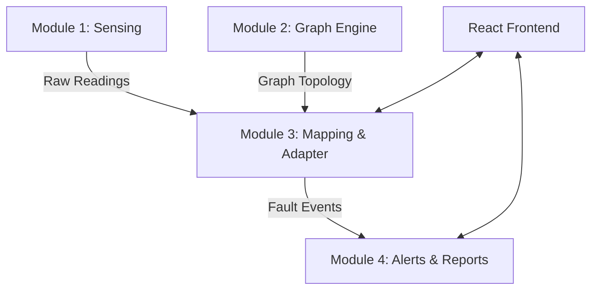

# Underground Cable Fault Distance Locator with Graph-Based Digital Mapping

This project implements a web-based cable fault detection and mapping system, structured in 4 modular components. It builds upon a hardware system for fault sensing by adding full digital mapping, live alerts, JWT-based authentication, and automated reporting.

## Architecture & Module Ownership

This project is divided into four main modules:

1. **Module 1: Fault Sensing Engine**
   - Implements hardware sensing formula pipeline (ADC -> Voltage -> Resistance -> Distance).
   - Injects simulated faults for end-to-end testing.
2. **Module 2: Graph Engine & Layout**
   - Handles physical node and edge (cable) digitization.
   - Calculates the shortest path and nearest node to any given fault distance using Dijkstra's algorithm.
3. **Module 3: Mapping & UI Integration**
   - Frontend map visualization (React/Vite).
   - Listens to real-time fault events via Socket.IO.
4. **Module 4: Authentication, Alerts, & Reports**
   - User authentication and route protection with JWT.
   - Fault event logging, real-time alert notifications, and historical CSV exports.



## Setup & Running Instructions

### Option 1: Docker Compose (Recommended)
You can bring up the entire stack (Backend + Frontend) via Docker.
1. Copy `.env.example` to `.env` and set a secure `JWT_SECRET`.
2. Run `docker-compose up --build`.
3. The frontend is accessible at `http://localhost:3000`.

### Option 2: Manual Run
#### Backend
```bash
cd backend
python -m venv .venv
source .venv/bin/activate  # or .venv\Scripts\activate on Windows
pip install -r requirements.txt
export JWT_SECRET="your-secret"
python app.py
```

#### Frontend
```bash
cd frontend
npm install
npm run dev
```
The Vite dev server will run on port 5173 and proxy API requests to `http://localhost:5000`.

## API Summary
- **Module 1 (Sensing)**: `POST /api/module1/simulate/inject-fault`
- **Module 2 (Graph)**: `GET/POST /api/module2/nodes`, `GET/POST /api/module2/edges`, `GET /api/module2/graph/nearest`
- **Module 3 (Map)**: `WS /readings/stream`, `WS /fault-events/stream`
- **Module 4 (Auth & Reports)**: `POST /api/module4/auth/register`, `POST /api/module4/auth/login`, `GET /api/module4/reports/fault-history`
